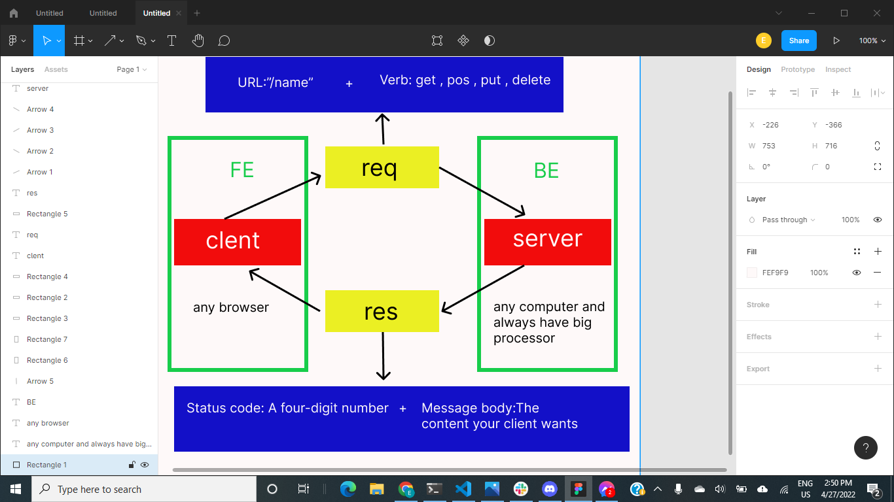

# Movies-Library - v16.14.2

**Essa Iyad Abu al-Khair**

## WRRC

.png)

.png)

## Overview

//routs

### app.post('/addMovie', postHandler);

create a post request to save a specific movie to database along with your personal comments.

### app.get('/getMovies', getHandler);
Create a get request to get all the data from the database

## Getting Started

1. Require the package

2. Create express app

3. The server is listening on port

## Project Features

We will become a global platform and we may reach the stage of producing our own films and displaying them on our platform
